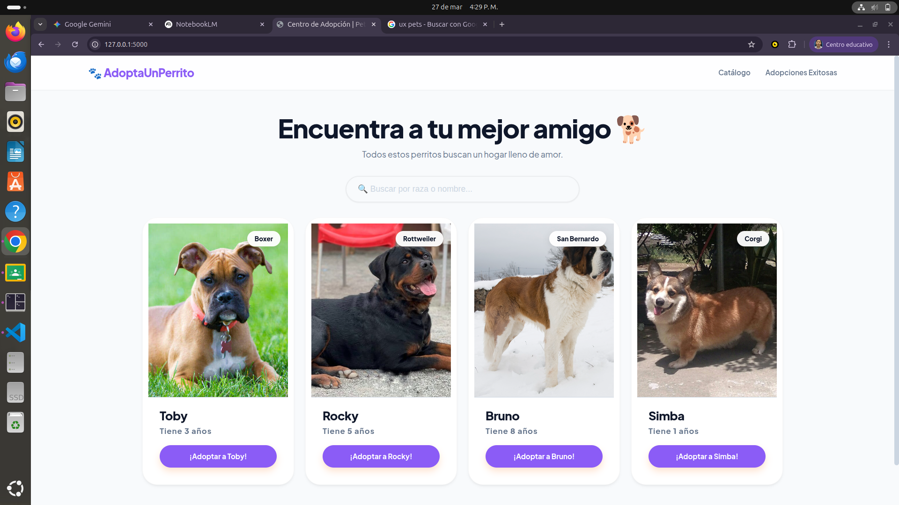
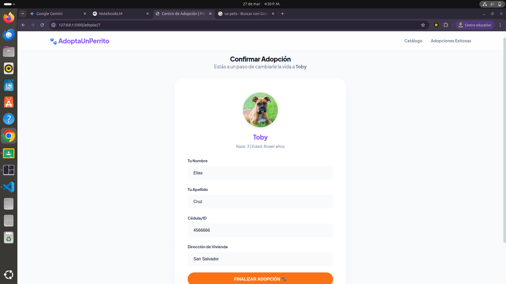

# 🐾 Centro de Adopción de Mascotas

Este es un proyecto web desarrollado con **Python** y **Flask** para gestionar la adopción de perros. El sistema permite visualizar mascotas disponibles, registrar adoptantes mediante un proceso seguro y mantener un historial detallado de cada adopción.

## Funcionalidades
- **Catálogo Dinámico:** Lista de perros que aún no han sido adoptados.
- **Registro Seguro:** Validación de identidad por cédula para evitar duplicados.
- **Transacciones SQL:** Uso de MariaDB para asegurar que los datos se guarden correctamente.
- **Historial:** Panel para revisar quién adoptó a cada mascota.

## Demostración (Capturas de Pantalla)

### 1. Inicio (Catálogo)

### 2. Formulario de Adopción

### 3. Historial de Adopciones

## Instalación
1. Clona el repositorio.
2. Crea tu entorno virtual: `python -m venv venv`.
3. Instala las librerías: `pip install -r requirements.txt`.
4. Crea tu archivo `.env` con tus credenciales de MariaDB.
5. Ejecuta con: `flask run`.

---
Desarrollado por Paola Rodríguez - 2026