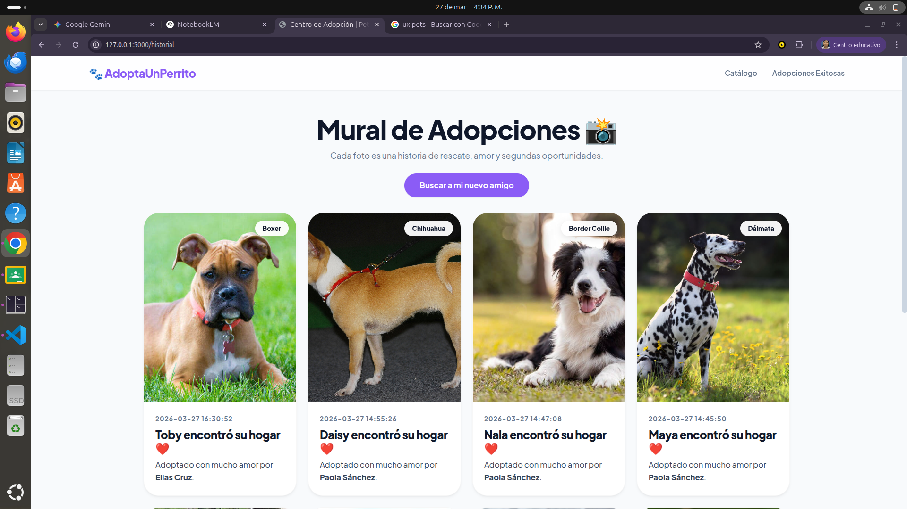

# 🐾 Sistema Integral: Centro de Adopción de perros


Este proyecto es una plataforma web diseñada para automatizar la gestión de un refugio de animales. El enfoque principal es garantizar la integridad de los datos y la seguridad de la información sensible mediante el uso de buenas prácticas de desarrollo.

## 🌟 Funcionalidades Detalladas

### 1. Gestión Dinámica de Inventario
El sistema filtra en tiempo real los registros de la base de datos. Solo los perros con el estado `adopted = 0` son visibles para los usuarios, asegurando que el catálogo siempre esté actualizado sin intervención manual.

### 2. Seguridad y Protección de Datos
- **Variables de Entorno:** Se implementó `python-dotenv` para separar las credenciales de la base de datos del código fuente, evitando fugas de información en el repositorio público.
- **Validación de Identidad:** El sistema verifica la existencia de la cédula en la tabla `Person` antes de crear un nuevo registro, optimizando el almacenamiento y evitando la duplicidad de datos.

### 3. Transacciones SQL Robustas
Para el proceso de adopción se utilizan **transacciones atómicas**. Esto garantiza que si falla el registro del adoptante, no se marque al perro como adoptado por error, manteniendo la base de datos siempre consistente.

---

## 📸 Demostración del Sistema

### 🏠 Vista Principal (Catálogo)
Interfaz limpia donde se presentan las mascotas disponibles para adopción.


### 📝 Formulario de Adopción Segura
Módulo donde se recopilan los datos del adoptante y se procesa la lógica de negocio.


### 📋 Historial de Movimientos
Panel administrativo que muestra el éxito de las transacciones de adopción realizadas.


---

## 🛠️ Guía de Instalación Local

Para replicar este entorno en tu máquina local, sigue estos pasos detallados:

1. **Clonación del Proyecto:**
   ```bash
   git clone [https://github.com/tu-usuario/nombre-del-repo.git](https://github.com/tu-usuario/nombre-del-repo.git)
   cd nombre-del-repo
Entorno Virtual (Aislamiento de Dependencias):
Es fundamental para evitar conflictos con otras versiones de Python.

Bash
python -m venv venv
source venv/Scripts/activate  # En Windows usa: venv\Scripts\activate
Instalación de Librerías:

Bash
pip install -r requirements.txt
Configuración de Variables Secretas:
Crea un archivo llamado .env en la raíz con tus credenciales:

Ini, TOML
DB_HOST=localhost
DB_USER=tu_usuario
DB_PASSWORD=tu_contraseña
DB_NAME=CentroAdopcion
Lanzamiento:

Bash
flask run